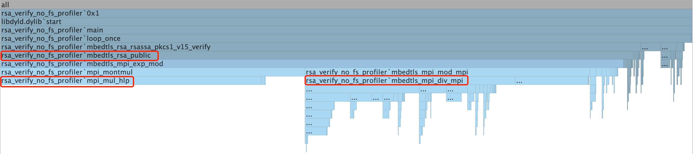

# Mbedtls RSA Performance Tuning on RISC-V

## Background
We're porting Mbedtls to RISC-V architecture to get RSA signature verification functionality.
The code will run on [CKB-VM](https://github.com/nervosnetwork/ckb-vm), 
a pure software implementation of the RISC-V instruction set used as scripting VM in CKB. 
It's required to run as fast as possible, also with very small code size.

## Preparation
In order to port it on RISV-V, we have make a sample program:
[rsa_verify_no_fs](https://github.com/XuJiandong/mbedtls/blob/iterator-1/programs/pkey/rsa_verify_no_fs.c)

With following changes, it can run on CKB-VM:
1. [config.h](https://github.com/XuJiandong/mbedtls/blob/iterator-1/include/mbedtls/config.h)
2. [Makefile](https://github.com/XuJiandong/mbedtls/blob/iterator-1/programs/pkey/Makefile)

Note, it's required to make sure "riscv64-unknown-elf-gcc" can be invoked from command line.
Get more information about how to get [RISC-V GNU toolchain](https://github.com/nervosnetwork/ckb-riscv-gnu-toolchain). Also have a CKB-VM program to run it. I choose this one[asm64](https://github.com/nervosnetwork/ckb-vm-test-suite/blob/master/binary/src/asm64.rs) with modification(show cycles).
Finally, we can try the following:
```text
► make run
RISCV CC -Os rsa_verify_no_fs.c
RISCV CC and LD -Os rsa_verify_no_fs.o
Cycles = 1955865
Done. There should be no output(return 0).

► make fail
There will be output like this: Ok(1)
Cycles = 1955886
Error result: Ok(1)
Failed as expected.

```
Here we have a small, run-able sample code base of RSA signature verification. 

## Performance and code size on RISC-V
With options -O3, -O2, -Os(see script [run_with_cflags.sh](https://github.com/XuJiandong/mbedtls/blob/iterator-1/programs/pkey/run_with_cflags.sh)), we have different cycles on CKB-VM and code size, as following:
RSA Key Size | Option | CPU Cycles    | Code size
-------------|--------|---------------|--------------
1024-bit | -O3    | 1,831K cycles | 247K bytes
1024-bit | -O2    | 1,828K cycles | 228K bytes
1024-bit | -Os    | 1,955K cycles | 220K bytes
2048-bit | -Os    | 6,780K cycles | 220K bytes

Note, with option of -O2 is better than with -O3. 
Here we can see, -O2 is the best with just a little more code size. RSA key size with 2048-bit is about ~4 times compared to 1024-bit.

## Benchmark
Without mature tool on RISC-V for profiler, we're going to try benchmark on simulator:
- Run it on PC (Mac OS)
- Release mode with no assembly code (remove macro MBEDTLS_HAVE_ASM)
- Use CLion to generate profiler report

As mbedtls is written in pure C, if we can have performance increased on PC, we can also have performance gained on RISC-V. This is one of the directions to try. Another direction is to rewrite some C code into assembly. Actually mbedtls has some function implementations in assembly language(see mpi_mul_hlp).

It's very important to have a base line to do performance tuning, with that we can do comparison. Uncomment "FOR_PROFILE" macro  in [rsa_verify_no_fs](https://github.com/XuJiandong/mbedtls/blob/iterator-1/programs/pkey/rsa_verify_no_fs.c).
We get a base line now. There is a 200000 loops because CLion use sampling method (DTrace) to profile. Without so many loops, DTrace can't capture enough information.

## FlameGraph
After profile this program, we get following FlameGraph:

It's obvious that mbedtls_rsa_public consumes the most of cycles(91.5%). We then break it down, and find that the 2 functions are the bottleneck:
- mbedtls_mpi_div_mpi (30.4%)
- mpi_mul_hlp (37.7%)

The first one is to perform a division with remainder of two MPIs:A = Q * B + R. The second one is mainly used in mpi_montmul: [Montgomery multiplication](https://en.wikipedia.org/wiki/Montgomery_modular_multiplication): A = A * B * R^-1 mod N.


### mbedtls_mpi_div_mpi
The most critical sub-function is mbedtls_mpi_mul_mpi, takes 16.5%.

### mpi_mul_hlp
This function is heavily optimized for the following ISA:
 * IA-32 (386+)         . AMD64 / EM64T
 * IA-32 (SSE2)         . Motorola 68000
 * PowerPC, 32-bit      . MicroBlaze
 * PowerPC, 64-bit      . TriCore
 * SPARC v8             . ARM v3+
 * Alpha                . MIPS32

Unfortunately, RISC-V is not included and can only use generic C version. Let's take a look at the source code:
```C++
void mpi_mul_hlp( size_t i, mbedtls_mpi_uint *s, mbedtls_mpi_uint *d, mbedtls_mpi_uint b )
{
    mbedtls_mpi_uint c = 0, t = 0;

#if defined(MULADDC_HUIT)
    for( ; i >= 8; i -= 8 )
    {
        MULADDC_INIT
        MULADDC_HUIT
        MULADDC_STOP
    }

    for( ; i > 0; i-- )
    {
        MULADDC_INIT
        MULADDC_CORE
        MULADDC_STOP
    }
#else /* MULADDC_HUIT */
    for( ; i >= 16; i -= 16 )
    {
        MULADDC_INIT
        MULADDC_CORE   MULADDC_CORE
        MULADDC_CORE   MULADDC_CORE
        MULADDC_CORE   MULADDC_CORE
        MULADDC_CORE   MULADDC_CORE

        MULADDC_CORE   MULADDC_CORE
        MULADDC_CORE   MULADDC_CORE
        MULADDC_CORE   MULADDC_CORE
        MULADDC_CORE   MULADDC_CORE
        MULADDC_STOP
    }

    for( ; i >= 8; i -= 8 )
    {
        MULADDC_INIT
        MULADDC_CORE   MULADDC_CORE
        MULADDC_CORE   MULADDC_CORE

        MULADDC_CORE   MULADDC_CORE
        MULADDC_CORE   MULADDC_CORE
        MULADDC_STOP
    }

    for( ; i > 0; i-- )
    {
        MULADDC_INIT
        MULADDC_CORE
        MULADDC_STOP
    }
#endif /* MULADDC_HUIT */

    t++;

    do {
        *d += c; c = ( *d < c ); d++;
    }
    while( c != 0 );
}
```
On any optimized ISA(for example, IA-32), macro MULADDC_HUIT is defined and used. 
Without this macro, it uses generic C version. 

We have a lot example assembly code in bh_mul.h, I think it's a good option to implement them in RISC-V. The following is an x86_64 version:
```C++
#if defined(__amd64__) || defined (__x86_64__)

#define MULADDC_INIT                        \
    asm(                                    \
        "xorq   %%r8, %%r8\n"

#define MULADDC_CORE                        \
        "movq   (%%rsi), %%rax\n"           \
        "mulq   %%rbx\n"                    \
        "addq   $8, %%rsi\n"                \
        "addq   %%rcx, %%rax\n"             \
        "movq   %%r8, %%rcx\n"              \
        "adcq   $0, %%rdx\n"                \
        "nop    \n"                         \
        "addq   %%rax, (%%rdi)\n"           \
        "adcq   %%rdx, %%rcx\n"             \
        "addq   $8, %%rdi\n"

#define MULADDC_STOP                        \
        : "+c" (c), "+D" (d), "+S" (s)      \
        : "b" (b)                           \
        : "rax", "rdx", "r8"                \
    );

#endif /* AMD64 */
```


## Why optimize mpi_mul_hlp heavily?

With C:
```text
$time ./rsa_verify_no_fs_profiler 
real	0m4.902s
user	0m4.833s
sys	    0m0.018s
```

with ASM:
```text
time ./rsa_verify_no_fs_profiler 
real	0m4.792s
user	0m4.755s
sys	    0m0.017s
```

We can't see significant improvement on MacOS, only have ~2.5% increased. But, remember it's on simulator, 
it's still possible to get performance increased on RISC-V. 

It is not a good idea to translate the C code into RISC-V assembly code line by line. The compiler can do this better than human.
Maybe we need to adopt new RISC-V instructions, like V extension, RV128I. Or even add a syscall to these frequently used functions.

## Optimize C code
Focus on these 2 functions:
- mbedtls_mpi_div_mpi (30.4%)
- mpi_mul_hlp (37.7%)

Let's look into them and maybe have chance to optimize them. TODO.

## Conclusion
We have ported  one of the functionalities of mbedtls: RSA signature verification to RISC-V and run it on CKB-VM successfully. It'
s a potential method to implement mpi_mul_hlp in RISC-V assembly language to increased performance. It might require CKB-VM to implement new instructions.
