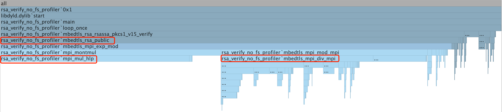

# Mbedtls RSA Performance Tunning on RISC-V

## Background
We're porting Mbedtls to RISC-V architecture to get RSA signature verification functionality.
The code will run on [CKB-VM](https://github.com/nervosnetwork/ckb-vm), 
a pure software implementation of the RISC-V instruction set used as scripting VM in CKB. 
It's required to run as fast as possible, also with very small code size.

## Preparation
In order to port it on RISV-V, we have make a sample program:
[rsa_verify_no_fs](https://github.com/XuJiandong/mbedtls/blob/iterator-1/programs/pkey/rsa_verify_no_fs.c)

With following changes, it can run on CKB-VM:
1. [config.h](https://github.com/XuJiandong/mbedtls/blob/iterator-1/include/mbedtls/config.h)
2. [Makefile](https://github.com/XuJiandong/mbedtls/blob/iterator-1/programs/pkey/Makefile)

Note, it's required to make sure "riscv64-unknown-elf-gcc" can be invoked from command line.
Get more information about how to get [RISC-V GNU toolchain](https://github.com/nervosnetwork/ckb-riscv-gnu-toolchain). Also have a CKB-VM program to run it. I choose this one[asm64](https://github.com/nervosnetwork/ckb-vm-test-suite/blob/master/binary/src/asm64.rs) with modification(show cycles).
Fianally, we can try the following:
```bash
cd programs/pkey
make run
make fail
```
Here we have a small, run-able sample code base of RSA signature verification. 

## Performance and code size on RISC-V
With options -O3, -O2, -Os(see script run_with_cflags.sh), we have different cycles on CKB-VM and code size, as following:
| Option | CPU Cycles    | Code size
|--------|---------------|--------------
| -O3    | 1,831K cycles | 247K bytes
| -O2    | 1,828K cycles | 228K bytes
| -Os    | 1,955K cycles | 220K bytes
Note, with option of -O2 is better than with -O3. 
IHMO, -O2 is the best with just a little more code size.

## Benchmark
Without mature tool on RISC-V for profiler, we're going to try benchmark on simulator:
- Run it on PC (Mac OS)
- Release mode with no assembly code (remove macro MBEDTLS_HAVE_ASM)
- Use CLion to generate profiler report

As mbedtls is written in pure C, if we can have performance increased on PC, we can also have performance gained on RISC-V. This is one of the directions to try. Another direction is to rewrite some C code into assembly. Actually mbedtols has some function implementations in asssbely language(see mpi_mul_hlp).

It's very important to have a base line to do performane tunning, with that we can do comparasion. Uncomment "FOR_PROFILE" macro  in [rsa_verify_no_fs](https://github.com/XuJiandong/mbedtls/blob/iterator-1/programs/pkey/rsa_verify_no_fs.c).
We get a base line now. There is a 200000 loops because CLion use sampling method (DTrace) to profile. Without so many loops, DTrace can't capture enough information.

## Flamegraph
After profile this program, we get following FlameGraph:

It's obvious that mbedtls_rsa_public consumes the most of cycles(91.5%). We then break it down, and find 2 functions are the bottleneck:
- mbedtls_mpi_div_mpi (30.4%)
- mpi_mul_hlp (37.7%)

### mbedtls_mpi_div_mpi
In this functions, let's say if mbedtls_mpi_div_mpi is 100%. Then the functions called are:
* mbedtls_mpi_mul_int 54.3%
* mbedtls_mpi_shift_l 13.0%
* mbedtls_mpi_sub_mpi 10.0%
Let's focus on these 3 functions.

### mpi_mul_hlp
This function is heavily optimized for the following ISA:
 * IA-32 (386+)         . AMD64 / EM64T
 * IA-32 (SSE2)         . Motorola 68000
 * PowerPC, 32-bit      . MicroBlaze
 * PowerPC, 64-bit      . TriCore
 * SPARC v8             . ARM v3+
 * Alpha                . MIPS32

Unfortunately, RISC-V is not included and can only use generic C version. Let's take a look at the source code:
```C++
void mpi_mul_hlp( size_t i, mbedtls_mpi_uint *s, mbedtls_mpi_uint *d, mbedtls_mpi_uint b )
{
    mbedtls_mpi_uint c = 0, t = 0;

#if defined(MULADDC_HUIT)
    for( ; i >= 8; i -= 8 )
    {
        MULADDC_INIT
        MULADDC_HUIT
        MULADDC_STOP
    }

    for( ; i > 0; i-- )
    {
        MULADDC_INIT
        MULADDC_CORE
        MULADDC_STOP
    }
#else /* MULADDC_HUIT */
    for( ; i >= 16; i -= 16 )
    {
        MULADDC_INIT
        MULADDC_CORE   MULADDC_CORE
        MULADDC_CORE   MULADDC_CORE
        MULADDC_CORE   MULADDC_CORE
        MULADDC_CORE   MULADDC_CORE

        MULADDC_CORE   MULADDC_CORE
        MULADDC_CORE   MULADDC_CORE
        MULADDC_CORE   MULADDC_CORE
        MULADDC_CORE   MULADDC_CORE
        MULADDC_STOP
    }

    for( ; i >= 8; i -= 8 )
    {
        MULADDC_INIT
        MULADDC_CORE   MULADDC_CORE
        MULADDC_CORE   MULADDC_CORE

        MULADDC_CORE   MULADDC_CORE
        MULADDC_CORE   MULADDC_CORE
        MULADDC_STOP
    }

    for( ; i > 0; i-- )
    {
        MULADDC_INIT
        MULADDC_CORE
        MULADDC_STOP
    }
#endif /* MULADDC_HUIT */

    t++;

    do {
        *d += c; c = ( *d < c ); d++;
    }
    while( c != 0 );
}
```
On any optimized ISA(for example, IA-32), macro MULADDC_HUIT is defined and used. Without this macro, it use generic C.

